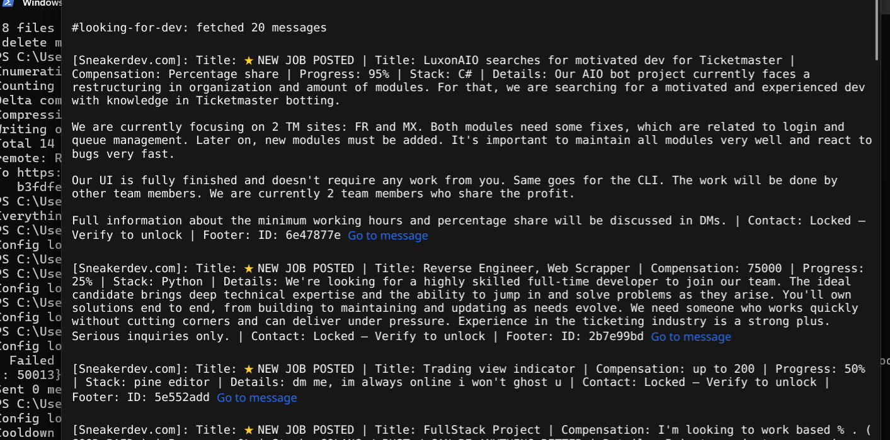

# DiscordFreelanceX

A lightweight Discord tool built in Go that helps freelancers stay on top of job postings across multiple servers. It monitors configured channels, pulls the latest messages, and lays everything out in a clean dark-themed GUI so you can quickly scan new gigs without jumping between servers. When you're ready to advertise, it auto-sends your pitch message to every channel on a configurable cooldown -- no babysitting required.

## Features

- **Multi-server message scanning** -- Fetches and displays the most recent messages from any number of guilds and channels, sorted newest-first.
- **Accept new messages and immediately links to them** -- Displays any new messages instantly with a notification so you are never late to applying for a job.
- **Forum channel support** -- Many such tools do not support forums, but this bot does!
- **Clean notifications** -- Immediately sends a notification (cross platform) upon any new job opening!
- **Rich embed parsing** -- Reads Discord embeds (job boards, bot posts, etc.) and extracts the useful bits: title, description, compensation, stack, and more.
- **One-click message links** -- Every fetched message includes a clickable "Go to message" link that takes you straight to the original post in Discord.
- **Auto-send with cooldown** -- Broadcasts your custom message to all configured channels with a built-in 6-hour cooldown so you don't spam.
- **Simple YAML config** -- Define your servers, channels, message text, and scan depth in a single `config.yaml` file.
- **Dark-themed desktop GUI** -- Built with Fyne; always-dark interface designed for long reading sessions.
